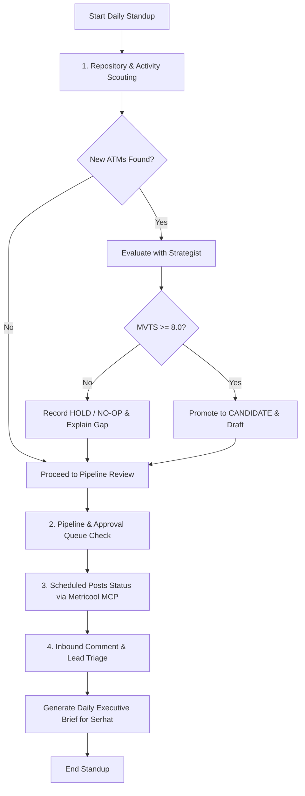

# Daily Standup Workflow: Personal Media Agency

The Daily Standup is an automated 15-minute agency routine executed every morning (e.g. 09:00 UTC+3) by the **MediaDirector**.

---

## Standup Checklist

### 1. Scouting & Ingestion
- Execute `scout` against GitHub repos and local lab notes.
- If an Atomic Technical Moment (ATM) is detected, hand off to `strategist`.
- If MVTS score $\ge 8.0$, queue for drafting; if $< 8.0$, register as `HOLD_NO_OP` with missing empirical data noted.

### 2. Pipeline Review
- Check `lifecycle/05_awaiting_approval/`: List any pending posts awaiting Serhat's signature.
- Check `lifecycle/06_approved/`: Trigger `publisher` for posts ready to be scheduled in Metricool.
- Check `lifecycle/07_scheduled/`: Verify upcoming scheduled publishing slots.

### 3. Community Triage
- Ingest new comments/DMs via Metricool MCP.
- Filter out noise; queue draft replies for high-signal discussions into `approvals/pending/`.

### 4. Executive Briefing Output
The MediaDirector outputs a concise, bulleted update:
- **Pipeline State**: Active ideas, drafts, pending approvals.
- **Decision Today**: Draft proposed OR NO-OP declared (with rationale).
- **Actions Needed from Serhat**: Pending approval requests to sign.
